# CI/CD Infrastructure on DigitalOcean with Terraform Cloud
#### Created by Dmitry Kozhel


## Scheme

This is a simple scheme of CD/CI infrasructure on DigitalOcean

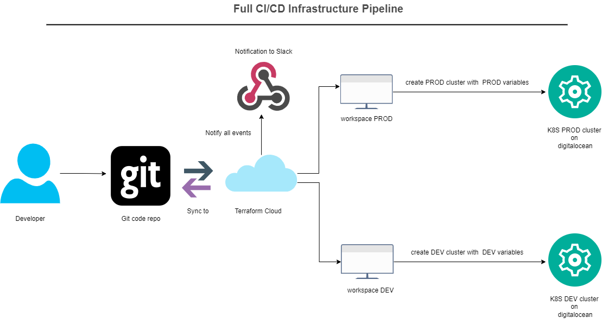


For this CI/CD I use:

- Github repository: https://github.com/ferdinant122/projectTMS-infrastructure
- Terraform Cloud
- DigitalOcean
- Slack

## Steps:


### Push code on repo and create accounts

First developer need to push code on repository

I push to repo several tf files

| File | Value |
| ------ | ------ |
| cluster.tf | tf file with creating cluster info |
| main.tf | tf file with providers |
| variables.tf | tf file with variables |


Second need to create accounts on  Terraform Cloud https://app.terraform.io/  and  DigitalOcean https://cloud.digitalocean.com/

In DigitalOcean need to create a acess token it will be used to connect Terraform cloud to DigitalOcean Cloud

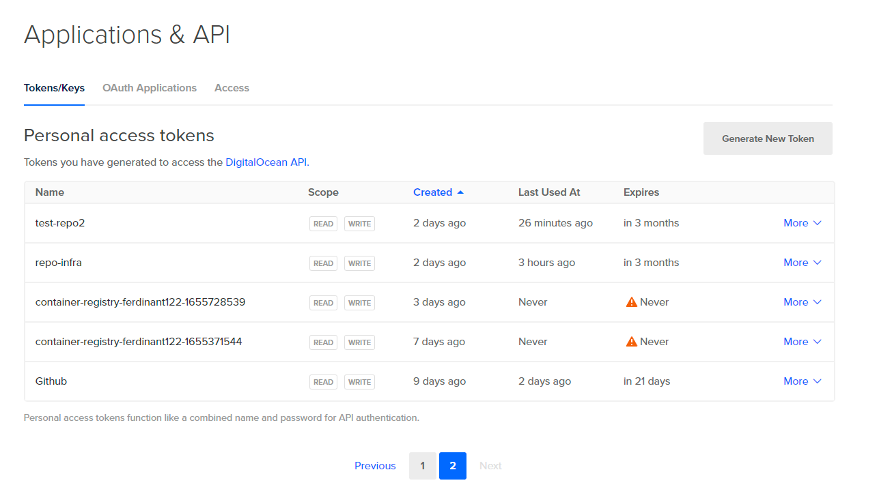


In Terraform Cloud  need create a Organization, my organization is ```dktmsproject```


### Create a workspaces in Terraform Cloud

After this need create a two workspace ``dev,prod``


Steps:

- In first step need to choise Type of workspace. I choise ```Version Control Workflow```

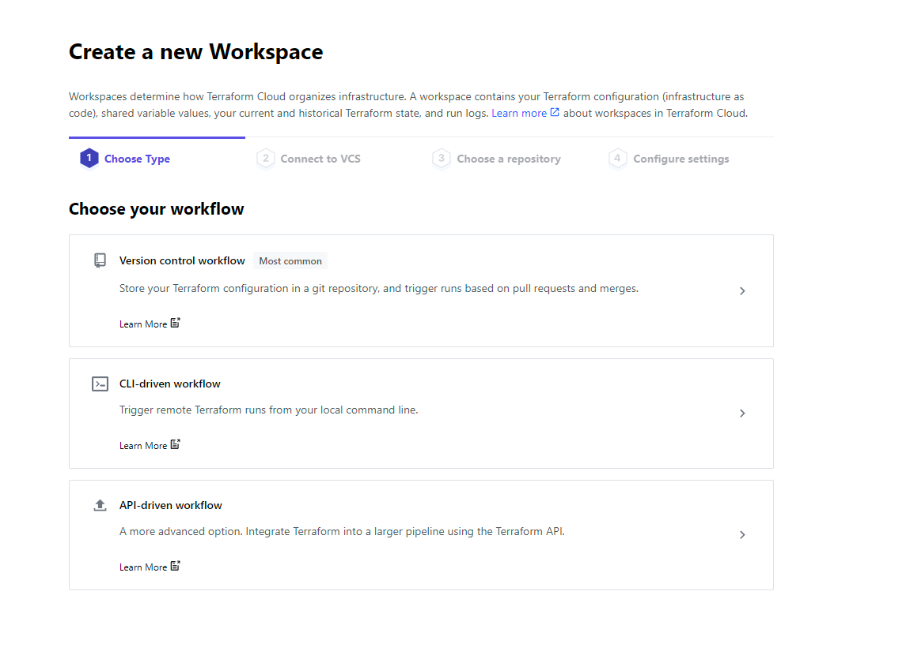


- Second step connect to github account and choise a repo, my repo is ``` https://github.com/ferdinant122/projectTMS-infrastructure ```


Connect Git
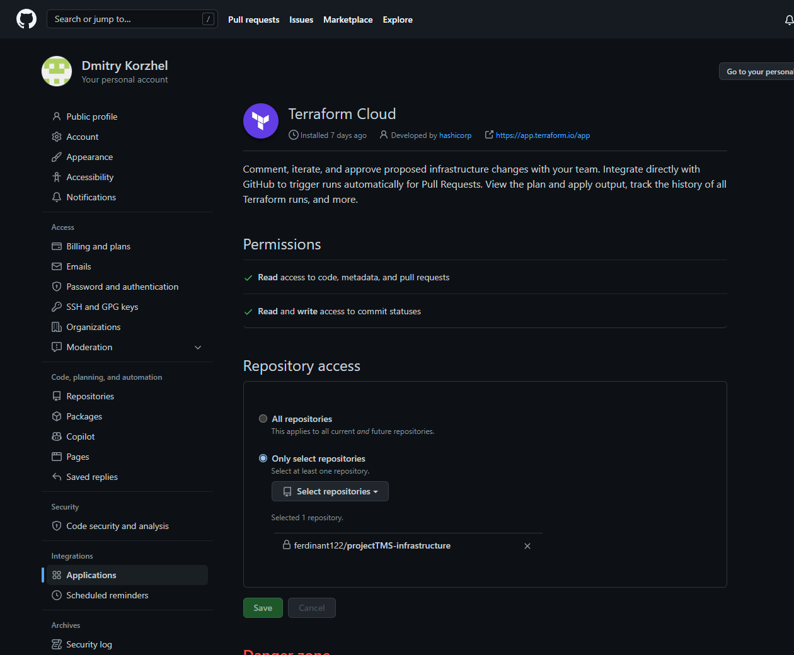


Choise Repo
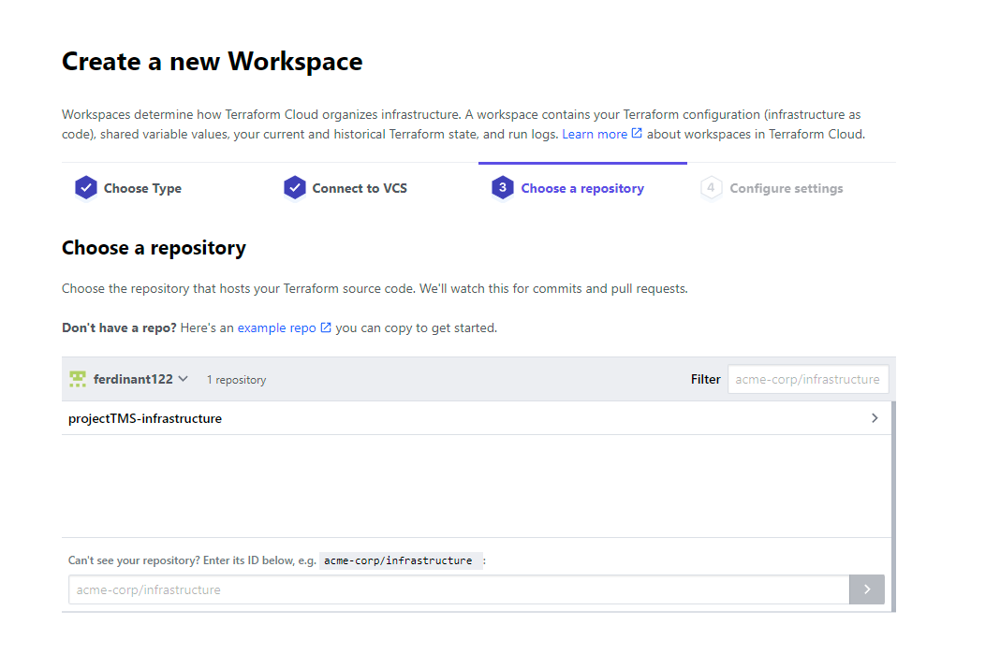


Two created workspaces 

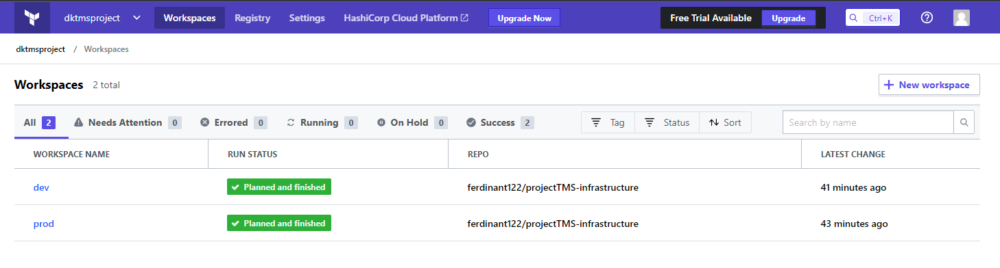

In this workspaces I need to add a variables (for each their own)


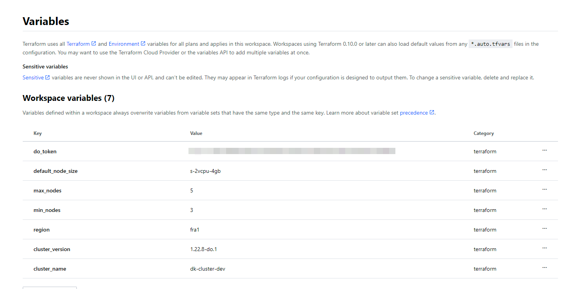


| Key | Value |
| ------ | ------ |
| do_token | Token for connect to DO |
| default_node_size | size of nodes (CPU&RAM) |
| max_nodes | max numbers of nodes |
| min_nodes | min numbers of nodes |
| region | region of cluster |
| cluster_version | version of cluster |
| cluster_name | name of cluster |

All of this variables  declared in ```variables.tf``` file

In general setting workspaces I choise  ```Manual Apply Method``` because I want to control my tf plan

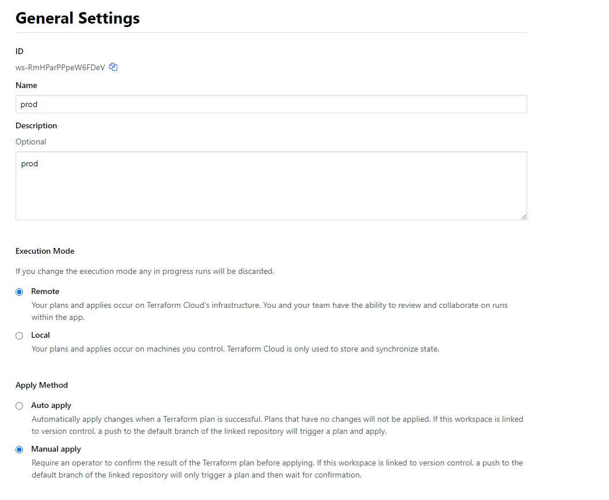


### Connect to slack via webhook

Also I connect Terraform Cloud with my Slack channel via Webhook because I want to recive all notify and see when to make a plan


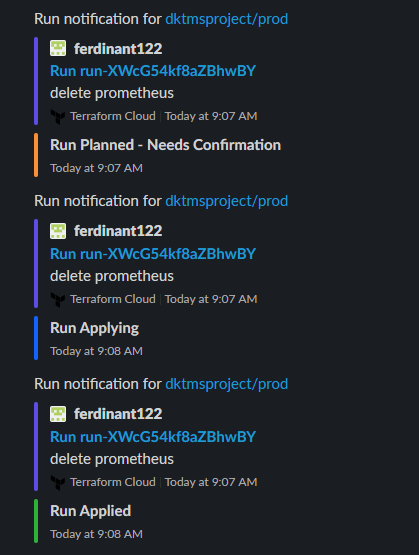


### Creating infrastructure

Terraform cloud scans github repo for the presence tf files and create a state (it stored on terraform cloud) 
If you change you tf files Terraform Cloud scan again repo and create new state and plan it.

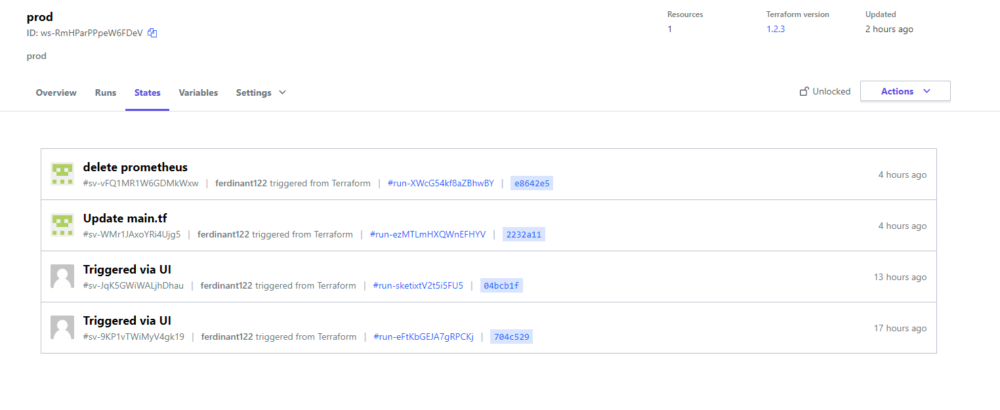

After I apply plan 

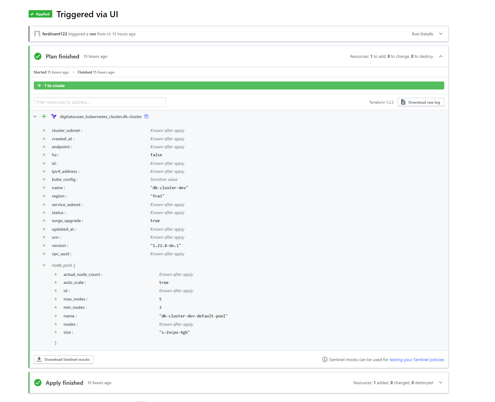

I see a two new k8s cluster in digital ocean

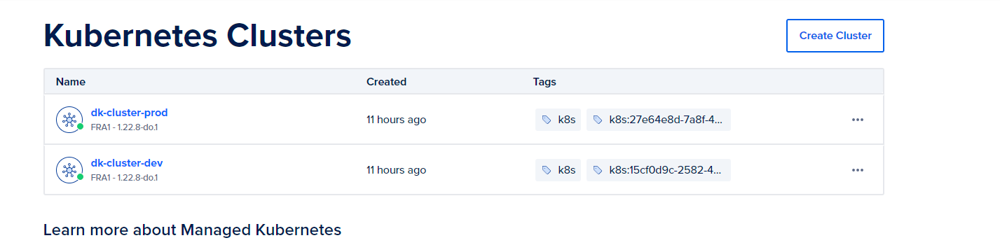

and nodes

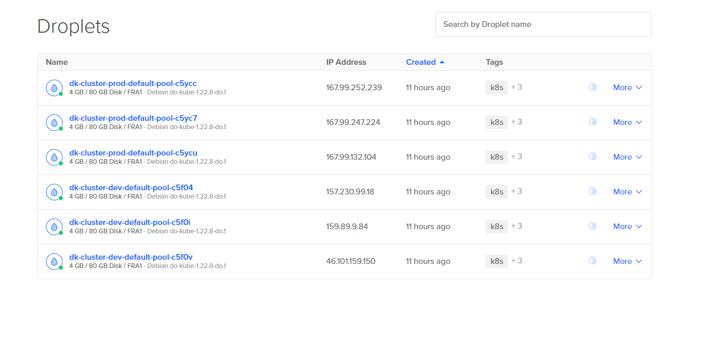

### Creating repo on DigitaOcean

Also need to create DigitalOcean repository and connet it to k8s clusters

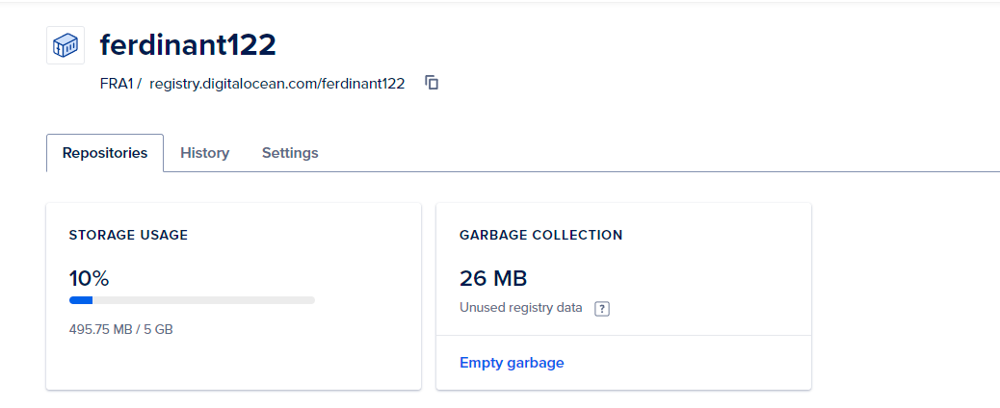

Connect repo to clusters

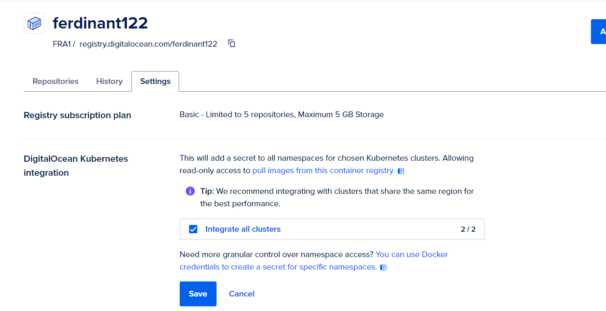

### Finish
That's all! You great!


